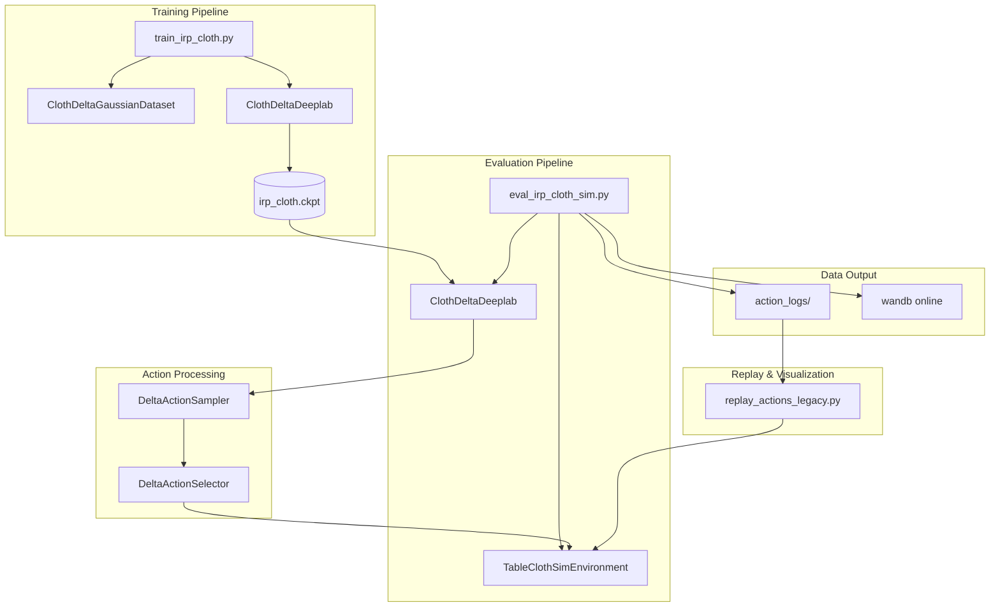
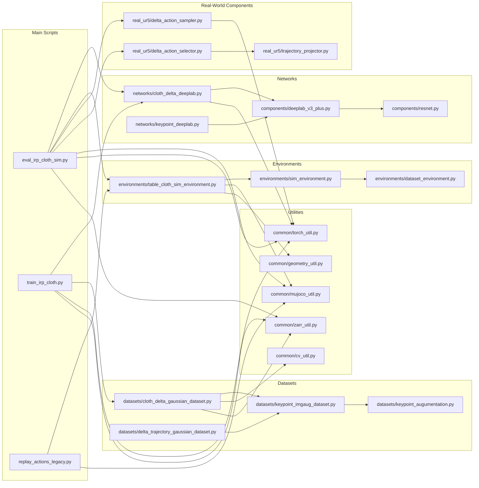
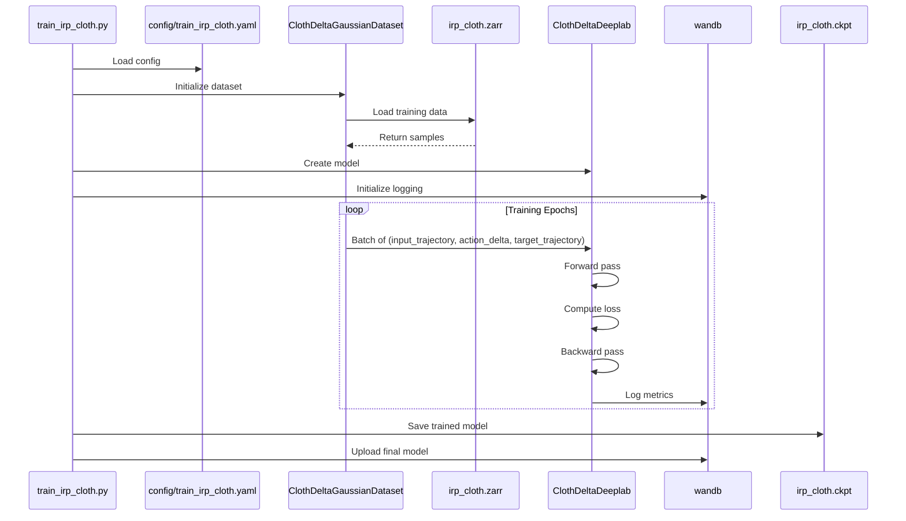
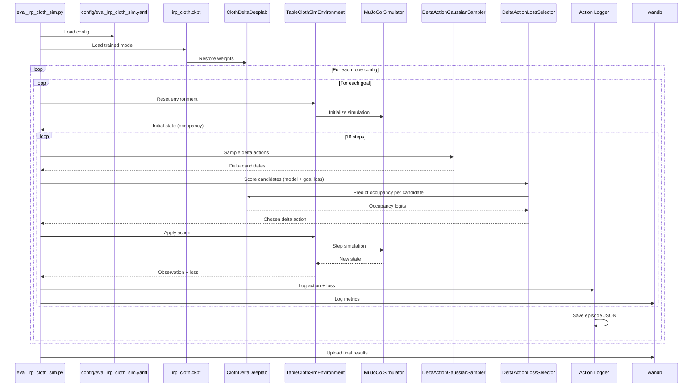
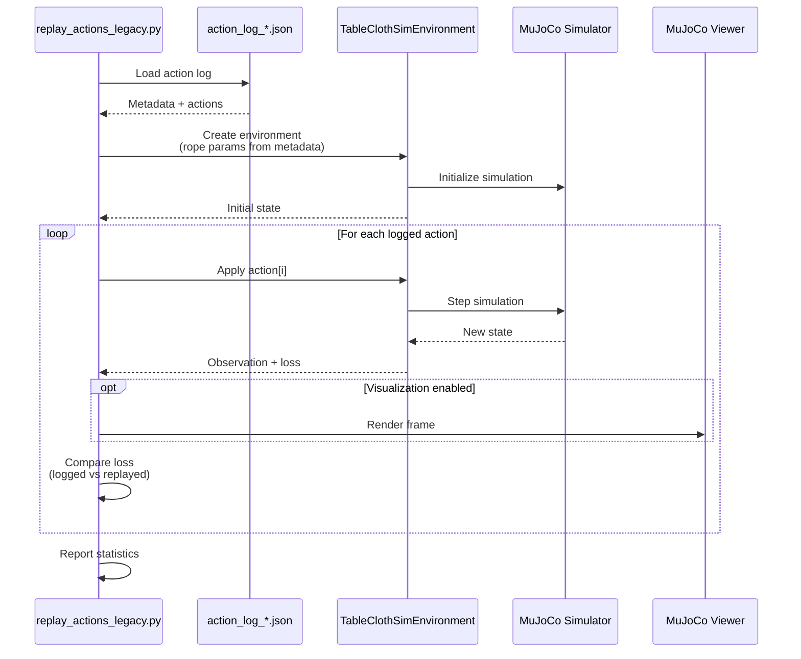

# 🏗️ IRP Project Architecture

Complete architecture diagram for the Iterative Residual Policy (IRP) cloth manipulation system from RSS 2022.

---

## 📐 High-Level System Architecture



---

## 🗂️ Detailed File Dependency Graph



---

## 🧠 Network Architecture

```mermaid
graph TB
    subgraph "ClothDeltaDeeplab (Trajectory Predictor)"
        INPUT[Current Trajectory Occupancy<br/>9x256x256]
        ACTION[Delta Action<br/>4D (normalized)]
        CONCAT[Concatenate channels]
        
        subgraph "DeepLab v3+"
            ENCODER[ResNet-101<br/>Feature Encoder]
            ASPP[ASPP Module<br/>Multi-scale Features]
            DECODER[Decoder<br/>Low-level Features]
        end
        
        OUTPUT[Predicted Occupancy<br/>9x256x256]
        
        INPUT --> CONCAT
        ACTION --> CONCAT
        CONCAT --> ENCODER
        ENCODER --> ASPP
        ASPP --> DECODER
        DECODER --> OUTPUT
    end
    
    subgraph "Action Selection"
        SAMPLER[DeltaActionGaussianSampler<br/>sample N deltas]
        SELECTOR[DeltaActionLossSelector<br/>min predicted loss]
        
        SAMPLER --> SELECTOR
        OUTPUT --> SELECTOR
    end
    
    subgraph "Output"
        ACTION_OUT[Delta Action<br/>4D: [duration, gy1, gz1, gy2]]
        SELECTOR --> ACTION_OUT
    end
```

---

## 🔄 Training Pipeline Flow



---

## 🎯 Evaluation Pipeline Flow



---

## 🎬 Replay Pipeline Flow



---

## 📦 Data Structure

### Input Data (irp_cloth.zarr)

```
irp_cloth.zarr/
├── dim_keys                   # (6,) ['cloth_size','cloth_density','duration','gy1','gz1','gy2']
├── dim_samples/
│   ├── cloth_size             # (4,) float64
│   ├── cloth_density          # (4,) float64
│   ├── duration               # (8,) float64 (normalized)
│   ├── gy1                    # (16,) float64 (normalized)
│   ├── gz1                    # (16,) float64 (normalized)
│   └── gy2                    # (16,) float64 (normalized)
├── traj_occu                  # (4,4,8,16,16,16,9,256,256) bool
├── is_valid                   # (4,4,8,16,16,16) bool
└── split/
    ├── is_train               # (4,4) bool
    └── is_val                 # (4,4) bool
```

**Notes**
- `traj_occu` stores 9-channel trajectory occupancy maps (one channel per cloth keypoint).
- Actions are normalized in [0,1] and mapped to physical parameters via `ActionMapper`.

### Output Data (action_logs/)

```json
{
  "metadata": {
    "run_id": "20251026_160517",
    "rope_id": 0,
    "rope_param": [0.46, 0.98],
    "goal_id": 0,
    "goal_alpha": 0.0,
    "n_steps": 16,
    "init_action": [0.87, 0.8, 0.7, 0.3],
    "timestamp": "2025-10-26T16:05:17"
  },
  "actions": [
    {
      "step_id": 0,
      "action": [0.87, 0.8, 0.7, 0.3],
      "delta_action": [-0.01, 0.02, -0.05, 0.0],
      "loss": 0.222108,
      "sigma": 0.111098,
      "threshold": 0.2
    }
  ]
}
```

---

## 🧩 Component Breakdown

### 1. Networks Layer

**ClothDeltaDeeplab** (`networks/cloth_delta_deeplab.py`)
- Purpose: Predict next trajectory occupancy given current occupancy and delta action
- Architecture: DeepLab v3+ with ResNet-101 backbone
- Input: 9x256x256 occupancy maps + 4D delta action (broadcast & concatenated)
- Output: 9x256x256 occupancy logits (sigmoid during inference)
- Key Methods:
  - `forward()`: Occupancy + delta action → occupancy logits
  - `training_step()`: Compute loss during training
  - `validation_step()`: Evaluate on validation set

**DeepLab v3+** (`components/deeplab_v3_plus.py`)
- Purpose: Semantic segmentation backbone
- Components:
  - ResNet encoder
  - ASPP (Atrous Spatial Pyramid Pooling)
  - Decoder with skip connections
- Pre-trained: ImageNet weights

**ResNet** (`components/resnet.py`)
- Purpose: Feature extraction
- Variants: ResNet-50, ResNet-101
- Modifications: Dilated convolutions for dense prediction

---

### 2. Environment Layer

**TableClothSimEnvironment** (`environments/table_cloth_sim_environment.py`)
- Purpose: MuJoCo simulation of cloth manipulation
- State Space:
  - Cloth: Represented as connected mass-spring system
  - Robot: UR5 arm with rope/stick tool
  - Goal: Target cloth configuration
- Action Space (normalized): [duration, gy1, gz1, gy2] in [0,1]
  - Mapped to physical parameters via `ActionMapper`
- Loss: Mean distance to goal configuration
- Key Methods:
  - `reset()`: Initialize episode
  - `step(action)`: Execute action, return observation
  - `get_traj_loss_func()`: Keypoint-based loss
  - `get_img_loss_func()`: Occupancy-based loss

**SimEnvironment** (`environments/sim_environment.py`)
- Purpose: Base class for all simulation environments
- Features:
  - MuJoCo XML loading
  - Camera management
  - Observation rendering

---

### 3. Action Processing

**DeltaActionSampler** (`real_ur5/delta_action_sampler.py`)
- Purpose: Generate candidate delta actions around current action
- Algorithm:
  1. Sample Gaussian noise in normalized action space
  2. Reject samples outside [0,1]
  3. Return delta actions (N samples)

**DeltaActionSelector** (`real_ur5/delta_action_selector.py`)
- Purpose: Choose best action from candidates
- Algorithm:
  1. For each candidate action:
     - Predict next occupancy with the network
     - Compute loss via goal distance on predicted occupancy
  2. Select delta with minimum predicted loss
- Note: For cloth eval, selection uses model predictions (no rollout simulation)

---

### 4. Dataset Layer

**ClothDeltaGaussianDataset** (`datasets/cloth_delta_gaussian_dataset.py`)
- Purpose: Sample valid (input, delta, target) trajectory triplets
- Data Source: `irp_cloth.zarr` (`traj_occu`, `is_valid`, `split`)
- Sampling:
  - Rejection-sample a base action and a delta action using `is_valid`
  - Load `input_trajectory` and `target_trajectory` from `traj_occu`
- Returns: `input_trajectory`, `action_delta`, `target_trajectory` (torch tensors)

**KeypointImgaugDataset** (`datasets/keypoint_imgaug_dataset.py`)
- Purpose: Image augmentation for keypoint datasets (rope tracking)
- Note: Not used in IRP cloth delta model training

---

### 5. Utilities

**mujoco_util.py** (`common/mujoco_util.py`)
- XML manipulation
- Camera matrix extraction
- Geom manipulation

**torch_util.py** (`common/torch_util.py`)
- Tensor operations
- Device management
- Model utilities

**geometry_util.py** (`common/geometry_util.py`)
- Rotation matrices
- Coordinate transformations
- Distance calculations

**cv_util.py** (`common/cv_util.py`)
- Image processing
- Keypoint visualization
- Heatmap generation

**zarr_util.py** (`common/zarr_util.py`)
- Zarr dataset loading
- Chunked reading
- Metadata extraction

---

## 🔬 Key Algorithms

### 1. Iterative Residual Policy (IRP)

```
Algorithm: IRP Control Loop
Input: Occupancy o_0, current action a_0, goal g, predictor f
Output: Sequence of actions a_0, ..., a_T

1. For t = 0 to T:
   a. Observe current occupancy: o_t
   b. Sample delta actions: ΔA = {Δa_1, ..., Δa_N} ~ N(0, σ)
   c. For each candidate Δa_i:
      - Predict next occupancy: o'_i = f(o_t, Δa_i)
      - Compute predicted loss: L_i = img_loss(o'_i, g)
   d. Select best delta: Δa* = argmin L_i
   e. Execute action: a_{t+1} = a_t + Δa*
   f. Step env → o_{t+1}, log true loss (traj_loss)
   g. If loss < threshold, break

2. Return action sequence
```

### 2. Gaussian Action Sampling

```
Algorithm: Sample Delta Actions
Input: Current action a, sigma σ, N samples
Output: N delta actions

1. For i = 1 to N:
   a. Sample noise: ε_i ~ N(0, σ²I)
   b. Candidate action: a_i = a + ε_i
   c. Reject if any component is outside [0,1]
   d. Store Δa_i = ε_i

2. Return {Δa_1, ..., Δa_N}
```

### 3. Loss Computation

```
Algorithm: Compute Losses (Cloth)
Input: Trajectory history H, goal keypoints G
Output: Loss values

1. Trajectory loss (used for logging):
   - Use final keypoints in H
   - Compute mean L2 distance to G

2. Image loss (used for action selection):
   - Convert predicted occupancy to binary masks
   - Compute per-keypoint pixel distance to goal
   - Return mean distance / pix_per_m
```

---

## 🚦 Execution Flow (eval_irp_cloth_sim.py)

### Initialization Phase
1. Load config from `config/eval_irp_cloth_sim.yaml`
2. Initialize wandb logging
3. Load pretrained model from `irp_cloth.ckpt`
4. Set up delta action sampler (Gaussian)
5. Set up delta action selector (model + loss)

### Episode Loop
```
FOR each rope configuration (5 total):
    rope_param = [cloth_size, density]
    
    FOR each goal position (11 total):
        goal_alpha = 0.0 to 1.0 (step 0.1)
        
        1. Create environment with rope_param
        2. Reset environment
        3. Set goal configuration (goal_alpha)
        4. Initialize action with [0.87, 0.8, 0.7, 0.3]
        
        FOR step = 0 to 15:
            a. Get observation (9-channel occupancy)
            b. Sample delta actions around current action
            c. Score candidates with model + img_loss
            d. Select best delta action
            e. Execute action in environment
            f. Compute actual loss (traj_loss)
            g. Log: step, action, delta, loss, sigma
            h. Check if loss < threshold (early stop)
            
        5. Save episode actions to JSON
        6. Log episode summary to wandb
```

### Cleanup Phase
1. Save all action logs to timestamped directory
2. Sync wandb data
3. Print summary statistics

---

## 📊 Data Flow Diagram

```
┌─────────────────────────────────────────────────────────────┐
│                      TRAINING PHASE                          │
└─────────────────────────────────────────────────────────────┘
                              │
                    irp_cloth.zarr
                    (N episodes)
                              │
                              ↓
                ┌─────────────────────────┐
                │ ClothDeltaGaussianDataset│
                └─────────────────────────┘
                              │
          (input_trajectory, action_delta, target_trajectory)
                              ↓
                ┌─────────────────────────┐
                │   ClothDeltaDeeplab     │
                │   (DeepLab v3+)         │
                └─────────────────────────┘
                              │
                       irp_cloth.ckpt
                       (trained model)
                              │
┌─────────────────────────────────────────────────────────────┐
│                     EVALUATION PHASE                         │
└─────────────────────────────────────────────────────────────┘
                              │
                              ↓
                ┌─────────────────────────┐
                │  eval_irp_cloth_sim.py  │
                └─────────────────────────┘
                    │             │
        ┌───────────┘             └───────────┐
        ↓                                     ↓
┌──────────────────┐               ┌──────────────────┐
│ ClothDeltaDeeplab│               │TableClothSimEnv  │
│  (load ckpt)     │               │   (MuJoCo)       │
└──────────────────┘               └──────────────────┘
        │                                     ↑
        ↓                                     │
┌──────────────────┐                         │
│DeltaActionSampler│                         │
│  (16 samples)    │                         │
└──────────────────┘                         │
        │                                     │
        ↓                                     │
┌──────────────────┐                         │
│DeltaActionSelector│─────action─────────────┘
└──────────────────┘
        │
        ↓
┌──────────────────┐
│  Action Logger   │
└──────────────────┘
        │
        ├─→ action_logs/*.json (local)
        └─→ wandb (online)

┌─────────────────────────────────────────────────────────────┐
│                      REPLAY PHASE                            │
└─────────────────────────────────────────────────────────────┘
        │
        ↓
┌──────────────────┐
│action_logs/*.json│
└──────────────────┘
        │
        ↓
┌──────────────────┐
│replay_actions.py │
└──────────────────┘
        │
        ↓
┌──────────────────┐
│TableClothSimEnv  │
│   (MuJoCo)       │
└──────────────────┘
        │
        ↓
┌──────────────────┐
│  Visualization   │
└──────────────────┘
```

---

## 🎨 Visualization Architecture

```mermaid
graph TB
    subgraph "Trajectory Occupancy Pipeline"
        ENV[TableClothSimEnvironment]
        MUJOCO[MuJoCo Simulator]
        KEYPOINTS[9 keypoint trajectories]
        OCCU[get_traj_occupancy()]
        OBS[Occupancy maps<br/>9x256x256]
        
        ENV --> MUJOCO
        MUJOCO --> KEYPOINTS
        KEYPOINTS --> OCCU
        OCCU --> OBS
    end
    
    subgraph "Optional Visualization"
        VIEWER[Legacy mujoco-py viewer (unstable)]
        MJ3[MuJoCo 3 replay (stable)]
        VIDEO[Video output]
        
        MUJOCO --> VIEWER
        MJ3 --> VIDEO
    end
```

---

## 🔧 Configuration System

```yaml
# config/eval_irp_cloth_sim.yaml (abridged)
setup:
  rope_config:
    table_height: 0.8
    table_y: 1
    table_size: 1.2
    cloth_spacing: 0.05
    cloth_density: 1.4
  controller_config:
    joint_names: ['gy', 'gz']
    kp: 100000
    kv: 100000
  selection:
    cloth_size_density: [[0.46, 0.98], [0.51, 0.73], [0.48, 1.27], [0.46, 1.35], [0.43, 0.66]]
    goal_alpha: [0.0, 0.1, 0.2, 0.3, 0.4, 0.5, 0.6, 0.7, 0.8, 0.9, 1.0]
  n_steps: 16
  traj_loss: {measure_dims: [0, 1, 2]}
  img_loss: {measure_dims: [0, 1]}
  obs_topdown: false
action:
  ckpt_path: data/checkpoints/irp_cloth.ckpt
  gpu_id: 0
  use_fp16: true
  init_action: [0.87, 0.8, 0.7, 0.3]
  sampler: {num_samples: 128, seed: 0, dim: 4}
  selector: {batch_size: 32}
  gain: 0.5
  sigma_max: 0.125
  constant_sigma: null
  threshold: {max: 0.2, min: 0.2, dist_max: 1.0}
wandb:
  project: cloth_eval_v2
```

---

## 🎯 Key Design Decisions

### 1. Why DeepLab v3+?
- **Dense prediction**: Outputs occupancy maps for 9 keypoint trajectories
- **Multi-scale features**: Cloth motion spans large and small spatial scales
- **Segmentation-friendly**: Designed for per-pixel classification tasks
- **Efficient**: Works well at 256x256 resolution

### 2. Why Iterative Residual Policy?
- **Handles uncertainty**: Gaussian delta sampling explores local action space
- **Error correction**: Residual updates refine actions step-by-step
- **Sample efficient**: Reuses the same predictor across iterations
- **No full dynamics model**: Predicts occupancy deltas instead of full simulation

### 3. Why MuJoCo?
- **Accurate physics**: Mass-spring cloth model for data generation
- **Fast simulation**: Supports large offline sweeps for dataset creation
- **Stable headless runs**: Viewer is unstable for cloth; headless is used
- **MJ3 for replay**: Newer MuJoCo used for visualization with simplified cloth

### 4. Why JSON Action Logs?
- **Human-readable**: Easy to inspect and debug
- **Self-contained**: Includes all metadata
- **Portable**: Can be shared and replayed anywhere
- **Extensible**: Easy to add new fields

---

## 🔍 Critical Code Sections

### 1. Action Mapping + Occupancy (`environments/table_cloth_sim_environment.py`)

```python
raw_action = self.action_mapper(action)
duration, gy1, gz1, gy2 = raw_action
...
kp_com = get_body_center_of_mass(self.sim.data, self.kp_ids)
hist.append(kp_com)
...
img = get_traj_occupancy(hist[:, i, [1, 2]], transformer=self.transformer)
obs = np.array(imgs)  # (9, 256, 256)
```

### 2. Delta Action Selection (`real_ur5/delta_action_selector.py`)

```python
input_trajectory = torch.from_numpy(traj_img).to(device)
delta_action = torch.from_numpy(samples).to(device)
probs = torch.sigmoid(self.model(input_trajectory, delta_action))
mask = to_numpy(probs) > threshold
loss = loss_func(mask)
best_delta = samples[np.argmin(loss)]
```

### 3. Dataset Sampling (`datasets/cloth_delta_gaussian_dataset.py`)

```python
rope_coord = rope_coords[rs.choice(len(rope_coords))]
# rejection sample base_action and next_action with is_setup_valid
input_trajectory = data_array[rope_coord + base_action_coord]
target_trajectory = data_array[rope_coord + next_action_coord]
action_delta = delta_coord / action_scale
```

---

## 🐛 Known Issues & Limitations

### 1. MuJoCo Cloth Instability
- **Issue**: Cloth simulation sometimes becomes unstable after first step
- **Symptoms**: QACC NaN warnings, unrealistic cloth positions
- **Cause**: Stiff constraints + small timestep + complex contact
- **Mitigation**: Try/except blocks in original code, continue to next step
- **Future**: Port flex cloth to MuJoCo 3 for improved stability

### 2. Visualization Segfault (mujoco-py)
- **Issue**: Segmentation fault when rendering during cloth simulation
- **Location**: `viewer.render()` inside `env.step()`
- **Mitigation**: Run headless (`show_vis=False`)
- **Workaround**: Replay action logs in MuJoCo 3

### 3. Image Saving in Legacy Replay
- **Issue**: `--save-images` can return empty obs and OpenCV errors
- **Workaround**: Use MuJoCo 3 replay to render videos

### 4. MuJoCo 3 Cloth Physics
- **Issue**: Flex cloth is not yet ported; MJ3 uses a rigid placeholder
- **Impact**: Accurate physics only in legacy headless runs

---

## 🚀 Future Improvements

### 1. Flex Cloth in MuJoCo 3
- Implement `<flexcomp>` cloth model for accurate physics and visualization

### 2. Dataset Regeneration Pipeline
- Recreate dataset when environment or action mapping changes
- Publish scripts + configs to document the data contract

### 3. Batch Video Rendering
- Script to render all action logs via MJ3 (`--video`)

### 4. Reproducible Environments
- Docker/CI for both `irp_legacy` and `irp` stacks

---

## 📚 References

### Paper
- Chi et al. "Iterative Residual Policy for Goal-Conditioned Dynamic Manipulation of Deformable Objects" (RSS 2022)

### Dependencies
- MuJoCo 2.1.2.14 / 3.3.6
- PyTorch 1.9.0+ / 2.8
- DeepLab v3+ implementation
- wandb for logging
- zarr for data storage

### Related Work
- DeepLab v3+: "Encoder-Decoder with Atrous Separable Convolution" (ECCV 2018)
- ResNet: "Deep Residual Learning" (CVPR 2016)
- IRP: Builds on residual policy learning

---

**Created**: October 26, 2025  
**Last Updated**: October 26, 2025  
**Status**: Complete architecture documentation for diploma
